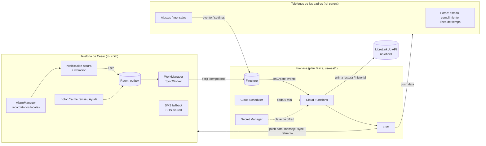

# 02 — Arquitectura

## Vista general



## Decisiones

| # | Decisión | Motivo |
|---|---|---|
| D1 | **Kotlin nativo + Jetpack Compose**, una sola app con dos roles | Todos usan Android. Da control fino de vibración, alarmas exactas y WorkManager. Un solo APK que mantener. |
| D2 | **Firebase en plan Blaze** (Firestore, Functions v2, FCM, Auth anónima, Secret Manager, Scheduler) | FCM es gratis. Las cuotas gratuitas cubren de sobra a una familia (costo esperado $0). Cloud Functions requiere Blaze. Se configura una alerta de presupuesto de USD 1. |
| D3 | Región **`us-east1`** | Es la más cercana a Venezuela con Always Free. |
| D4 | **Recordatorios locales** (AlarmManager) y no push desde el servidor | Deben funcionar sin internet. El servidor solo envía refuerzos y avisos a los padres. |
| D5 | **Outbox en Room** como fuente de verdad del niño, sincronizada por WorkManager | Firestore offline sirve de apoyo, pero su caché puede limpiarse y no expone bien el estado "pendiente". Room garantiza que ninguna revisión se pierda y que la UI sepa qué está pendiente (ver 07). |
| D6 | **IDs de evento generados en el cliente** (UUID) y escritura `set()` a ese ID | La sincronización es idempotente: los reintentos no duplican revisiones. |
| D7 | **Hora real = `clientAt`** (reloj del teléfono), con `createdAt` del servidor al llegar | Permite saber que se revisó a tiempo aunque se sincronice tarde. Se acota la desviación de reloj (ver 07). |
| D8 | LibreLinkUp consultado **solo desde Functions**, con credenciales **cifradas (AES-256-GCM)** y la clave en Secret Manager | El teléfono de Cesar no necesita permisos especiales y las credenciales nunca llegan a los clientes. |
| D9 | Auth **anónima** + **custom claims** `{ familyId, role }` asignados por Functions al vincular | No hay contraseñas para el niño, y las reglas de Firestore se evalúan sin lecturas extra. |
| D10 | **Pushes solo "data"** con prioridad alta; la app construye la notificación | Cada rol controla el canal, el sonido y la vibración. En el niño es imprescindible para garantizar que no haya sonido. |
| D11 | Distribución **por APK** (sideload) | Evita restricciones de Play (`USE_EXACT_ALARM`, `SEND_SMS`, pantalla completa). |

## Componentes

### App Android (`android/`)
- `data/local`: Room (`outbox_events`), DataStore (rol, familia, settings cacheados).
- `data/remote`: Firestore, Functions callables, FCM token.
- `reminders`: `ReminderSchedule` (lógica pura, compartida con el backend por contrato), `ReminderScheduler` (AlarmManager), receivers.
- `sync`: `SyncWorker` (sube el outbox), `SmsFallback`.
- `notify`: canales, `Haptics`, `ChildNotifier`, `ParentNotifier`.
- `push`: `PushService` (FirebaseMessagingService).
- `ui`: Setup, Child, ParentHome, ParentSettings, Permissions.

### Backend (`firebase/`)
- `functions/src/`: callables de familia y vinculación, LibreLinkUp, trigger de eventos, scheduler de slots sin respuesta, trigger de settings, cálculo de cumplimiento.
- `firestore.rules`, `firestore.indexes.json`, `firebase.json`.

## Costos estimados (una familia)

| Recurso | Uso aprox./mes | Cuota gratis |
|---|---|---|
| Invocaciones de Functions | ~12.000 (scheduler 8.640 + eventos) | 2.000.000 |
| Lecturas de Firestore | ~20.000 | 50.000 / **día** |
| Escrituras de Firestore | ~5.000 | 20.000 / día |
| Jobs de Cloud Scheduler | 1 | 3 gratis por cuenta |
| Secret Manager | 1 secreto | 6 versiones activas gratis |
| FCM | ilimitado | gratis |

> Verificar la página de precios de Firebase al momento de desplegar, porque las cuotas pueden cambiar.

## Estructura del repositorio

```
checkin/
├── CLAUDE.md
├── README.md
├── docs/                     # esta especificación
├── firebase/
│   ├── firebase.json
│   ├── firestore.rules
│   ├── firestore.indexes.json
│   └── functions/
│       ├── package.json
│       ├── tsconfig.json
│       └── src/
│           ├── index.ts
│           ├── config.ts
│           ├── schedule.ts        # lógica de slots (contrato compartido)
│           ├── time.ts            # helpers de zona horaria
│           ├── families.ts        # callables de familia/vinculación
│           ├── libre/
│           │   ├── client.ts
│           │   ├── crypto.ts
│           │   └── service.ts
│           ├── events.ts          # onEventCreated
│           ├── missed.ts          # scheduler
│           ├── compliance.ts      # resumen diario
│           ├── settings.ts        # onFamilyUpdated → sync
│           ├── messaging.ts
│           └── __tests__/
└── android/
    ├── settings.gradle.kts
    ├── build.gradle.kts
    ├── gradle/libs.versions.toml
    └── app/
        ├── build.gradle.kts
        └── src/main/java/com/ingeint/checkin/...
```
