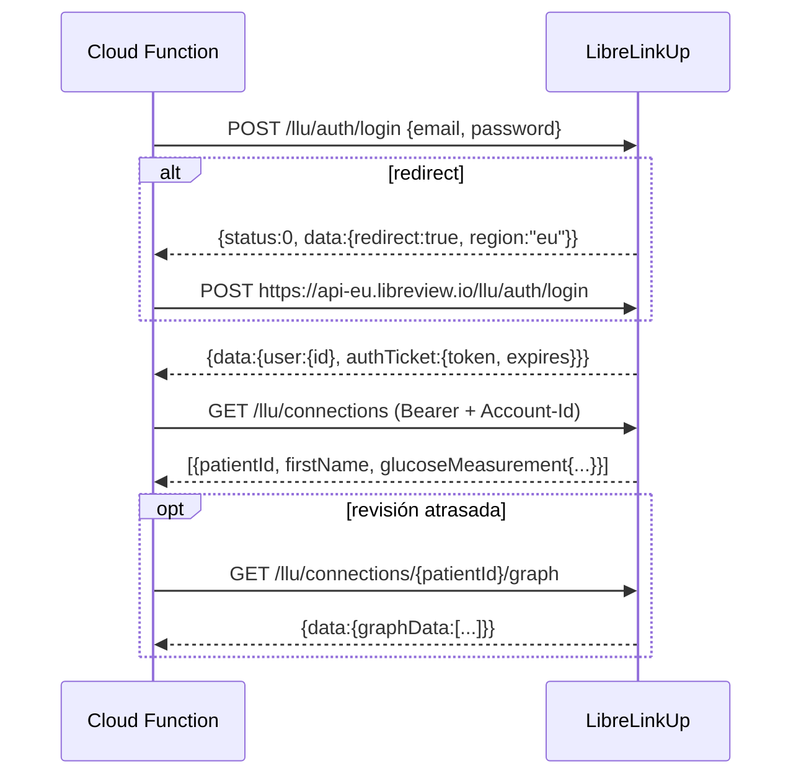

# 05 — Integración con LibreLinkUp

> ⚠️ **La API de LibreLinkUp no es oficial ni está documentada por Abbott.** Lo que sigue es cómo la usan proyectos de la comunidad como *nightscout-librelink-up* (timoschlueter) y *libre-link-up-api-client* (npm). Abbott puede cambiarla sin aviso. **Antes de implementar, Claude Code debe revisar el código actual de esos proyectos** para confirmar los headers, la versión mínima y los endpoints. El diseño asume que **puede fallar en cualquier momento**, y eso nunca debe bloquear una revisión ni un SOS.

## Requisitos previos
- Una cuenta de LibreLinkUp (la de un padre o una dedicada) que **siga** a Cesar y que haya aceptado los términos más recientes en la app oficial. Si no los aceptó, el login devuelve un paso pendiente (ver errores).
- Recomendación: crear una **cuenta de seguidor dedicada** para esta integración (por ejemplo `cesar.monitor@…`), invitada desde LibreLink del niño. Así las credenciales personales de los padres no se guardan, y se puede revocar sin afectar a nadie.

## Flujo



## Detalles
- **Base URL:** `https://api.libreview.io`. Tras la redirección: `https://api-{region}.libreview.io`. Se guarda la región.
- **Headers comunes:**
  ```
  accept-encoding: gzip
  cache-control: no-cache
  connection: Keep-Alive
  content-type: application/json
  product: llu.android
  version: <LLU_APP_VERSION>         # p. ej. 4.16.0; si es menor a la mínima, la API responde 403
  ```
- **Headers autenticados:** `Authorization: Bearer <token>` y `Account-Id: <sha256 hex de user.id>` (obligatorio en versiones recientes).
- **Login:** `POST /llu/auth/login`. Respuestas:
  - `status: 0` + `data.redirect === true` → reintentar en la región indicada.
  - `status: 0` + `data.authTicket` → OK. `authTicket.expires` es epoch en **segundos**.
  - `status: 2` → credenciales inválidas → `auth`.
  - `status: 4` (o `data.step`) → hay que aceptar términos en la app oficial → `terms`.
  - HTTP 403 con mensaje de versión mínima → `version` (subir `LLU_APP_VERSION` y redesplegar).
- **Conexiones:** `GET /llu/connections` → `data[]`. De cada una interesan `patientId`, `firstName`, `lastName` y `glucoseMeasurement`:
  - `ValueInMgPerDl` (número)
  - `TrendArrow` (1–5)
  - `FactoryTimestamp`: **UTC**, con formato `M/D/YYYY h:mm:ss AM|PM`. Se usa este y no `Timestamp`, que está en hora local del sensor.
- **Historial:** `GET /llu/connections/{patientId}/graph` → `data.graphData[]` con puntos de aproximadamente las últimas 12 h (mismos campos). Se usa para revisiones sincronizadas tarde: se toma el punto con `FactoryTimestamp` más cercano a `clientAt` dentro de ±10 min, y si no hay, `glucoseError = "stale"`.

## Sesión y caché
- Se guarda en `private/libre.sessionEnc` `{ token, expiresAt, accountId, region }`, cifrado.
- Se reutiliza si `expiresAt > ahora + 5 min`. Ante HTTP 401, se hace **un** relogin y un reintento.
- **Frecuencia:** consultar solo por evento (revisión o SOS), nunca por polling. Si llegan varias revisiones en menos de 60 s (por ejemplo, una ráfaga al sincronizar), se reutiliza la respuesta de conexiones cacheada en memoria de la instancia o se usa una sola consulta a `graph` para todo el lote.

## Validación de la lectura
- Se descarta si `readingAt` es más viejo que 15 min respecto a `clientAt` (`stale`). El sensor actualiza cada minuto, pero LibreLinkUp puede atrasarse si el teléfono del niño no tiene internet. **Es muy probable que coincida con las revisiones sin conexión**, y por eso existe el historial.
- `level`: `low` si el valor es menor a `lowThreshold`, `high` si es mayor a `highThreshold`, y `normal` en otro caso.

## Cifrado (`libre/crypto.ts`)
- AES-256-GCM. La clave es `sha256(LLU_ENC_KEY)` y el IV es aleatorio de 12 bytes.
- Formato: `base64(iv ‖ authTag ‖ ciphertext)`.
- `credentialsEnc = enc(JSON.stringify({ email, password }))`.
- Si se rota el secreto, las credenciales quedan ilegibles: la UI muestra "Vuelve a conectar LibreLinkUp".

## Estado visible para los padres
`families.libreStatus = { ok, lastError, lastSuccessAt }` se actualiza en cada intento. En Ajustes se muestra "LibreLinkUp: conectado (última lectura 10:40)" o el error con la acción correspondiente:

| Error | Mensaje en la UI |
|---|---|
| `auth` | "Usuario o clave incorrectos" |
| `terms` | "Abre LibreLinkUp y acepta los términos nuevos" |
| `version` | "La integración necesita actualización" (hay que subir `LLU_APP_VERSION`) |
| `network` | "LibreLinkUp no responde, se reintentará" |
| `no_data` | "No hay lecturas recientes del sensor" |
| `stale` | (en la línea de tiempo) "Sin lectura cercana a esa hora" |
| `not_configured` | "Conecta LibreLinkUp para ver el valor" |

## Alternativa futura (fase 3, opcional)
Leer la notificación persistente de LibreLink en el teléfono del niño con `NotificationListenerService`. Solo funciona si la versión instalada muestra el valor en la notificación. Tendría la ventaja de funcionar sin internet: el valor se guarda en el outbox junto a la revisión. Queda fuera del MVP.
