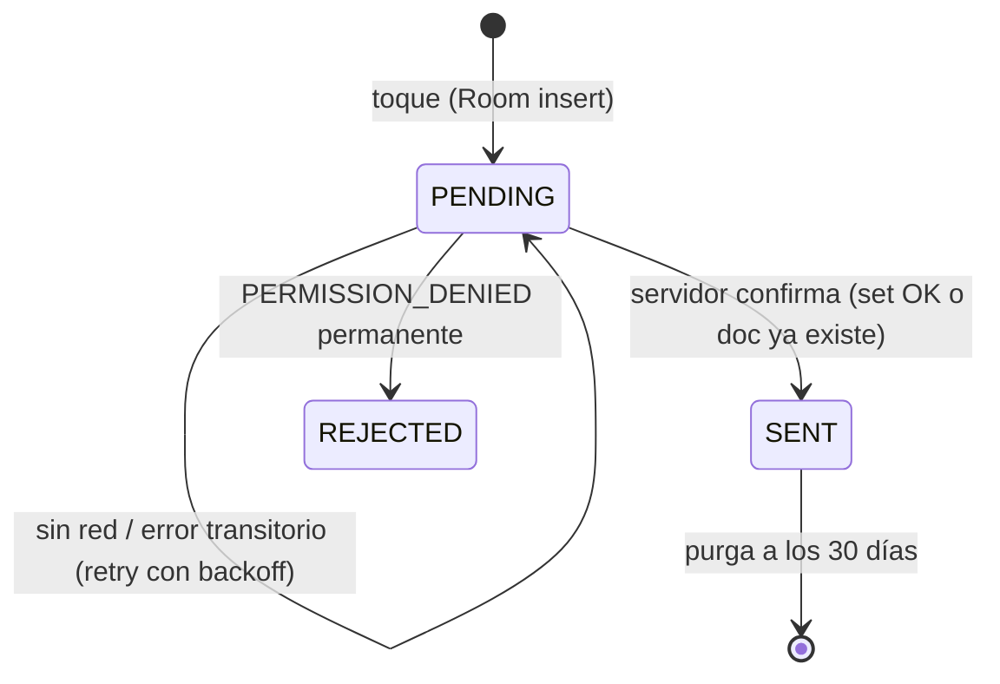

# 07 — Modo sin conexión y sincronización

**Requisito:** si Cesar no tiene internet, **todas** sus revisiones se guardan localmente con su hora real y se sincronizan al recuperar la conexión, para que los padres sepan que cumplió.

## Principios
1. **Room es la fuente de verdad local.** Una revisión existe desde que se escribe en `outbox_events`, antes de cualquier red. Si la escritura en Room falla (muy raro), se muestra un error y **no** se vibra `CONFIRM`.
2. **Todo lo local funciona sin red:** recordatorios (AlarmManager y settings cacheados), omisión de slots ya cubiertos, refuerzos y el estado en la UI.
3. **Sincronización idempotente:** el `eventId` es el UUID local y se escribe con `set()` a ese ID. Un reintento nunca duplica una revisión.
4. **La hora real manda:** `clientAt` es el momento del toque. El servidor calcula el cumplimiento con `clientAt` y marca `syncedLate` cuando llegó tarde.
5. **Nada se borra hasta confirmarse:** los `PENDING` se conservan indefinidamente, aunque pasen días.

## Flujo de una revisión

## `SyncWorker` (WorkManager)
- **Único y encadenado:** `enqueueUniqueWork("sync-outbox", ExistingWorkPolicy.APPEND_OR_REPLACE, …)`.
- Constraint `NetworkType.CONNECTED`, backoff exponencial (30 s inicial) y expedited con `OutOfQuotaPolicy.RUN_AS_NON_EXPEDITED_WORK_REQUEST`. Implementa `getForegroundInfo()` con una notificación en `sync_status` que dice "Sincronizando…", obligatorio para expedited en API < 31.
- Se encola:
  - al registrar cualquier evento,
  - al volver la red: callback de `ConnectivityManager.registerDefaultNetworkCallback` mientras la app vive, más la propia constraint de WorkManager,
  - en `BootReceiver`,
  - con un **periódico de respaldo** cada 15 min (`PeriodicWorkRequest`, `KEEP`).
- Algoritmo:
  1. Asegura la sesión (Auth anónima persistida) y refresca el ID token si hace falta.
  2. Lee los `PENDING` ordenados por `clientAt` ascendente, en lotes de 20.
  3. Por cada evento:
     - `docRef.set(payload).await()` con `withTimeout(15 s)`.
     - Éxito → `SENT`, `sentAt = now`.
     - `PERMISSION_DENIED` → hace `docRef.get(Source.SERVER)`. Si el doc existe, era un reintento de algo ya creado (las reglas no permiten update) y se marca `SENT`. Si no existe, fuerza `getIdToken(true)` y reintenta **una vez**. Solo si vuelve a fallar **y** el token no tiene los claims `familyId` y `role` (teléfono desvinculado), se marca `REJECTED` con `lastError`. En cualquier otro caso queda `PENDING` y el worker devuelve `Result.retry()`.
     - Timeout o `UNAVAILABLE` → `attempts++`, para el lote y devuelve `Result.retry()`.
  4. Si sincronizó alguna revisión **iniciada por el usuario en los últimos 2 min**, vibra `CONFIRM` **una vez** (no en ráfaga al sincronizar un lote viejo). Para lotes atrasados, basta con actualizar la UI con "3 revisiones sincronizadas".
- Payload: el `createdAt` es `FieldValue.serverTimestamp()` y `clientAt` es `Timestamp(Date(clientAt))`.
- Hay que tener en cuenta que, con la persistencia de Firestore activada, un `set()` sin red queda en la cola interna de Firestore y su `await` no termina hasta que el servidor confirma. Por eso se usa el timeout. Esa cola interna es inofensiva gracias a la idempotencia, pero **el estado real lo lleva Room**: un evento solo pasa a `SENT` cuando el servidor lo confirma.

## Desviación de reloj
- Las reglas aceptan un `clientAt` de hasta **7 días** en el pasado y hasta 24 h en el futuro. El servidor usa `realAt = min(clientAt, createdAt)`, así un reloj adelantado nunca provoca un rechazo ni horas futuras.
- La app guarda `clockOffset = serverTime − deviceTime` en cada sincronización exitosa, leyendo `createdAt` del doc recién escrito con `get(Source.SERVER)` una vez al día. Al **registrar** un evento, el cliente guarda en Room `clientAt = deviceNow + clockOffset` (ya corregido) y `clockOffsetMs`, que es informativo. Si `|offset| > 2 min`, diagnóstico advierte "La hora del teléfono no es automática".
- Recomendación de setup: hora automática activada en el teléfono de Cesar (paso del checklist de 10).

## SOS sin conexión
1. Se registra en el outbox, igual que una revisión.
2. Si `ConnectivityManager` indica que no hay red validada y `smsFallbackEnabled` está activo, `SmsFallback` envía un SMS a cada número de `smsNumbers`: `"{childName} necesita ayuda (10:42). Ubicación: https://maps.google.com/?q=lat,lng"` (sin ubicación: `"{childName} necesita ayuda (10:42)."`). El SMS **no** usa palabras médicas.
3. `smsSent = true` en el outbox. Cuando se sincronice, los padres ya estarán avisados y el push lo indica.
4. Si no hay señal celular, el SMS falla (`SmsManager` con `sentIntent`): la UI muestra "No se pudo enviar. Busca a un adulto" y queda pendiente en el outbox.
5. Hay que considerar el costo del SMS y el saldo del plan de Cesar.

## Mensajes de los padres sin conexión del niño
FCM guarda los mensajes según su TTL (ver la tabla de payloads en 04) y los entrega al reconectar. Pasado el TTL se descartan, porque un "Recuerda la lectura" de hace 2 h ya no sirve. Al abrir la app, el niño ve el último `parent_message` del día leyendo Firestore.

## Padres sin conexión
- Firestore con persistencia normal: la UI muestra los últimos datos cacheados con un aviso "Sin conexión".
- Los mensajes y el `sos_ack` de los padres usan **el mismo outbox** (Room existe en ambos roles) para no perderse.

## Qué ven los padres
- En tiempo real: "Recordatorio de las 10:40 sin respuesta (puede estar sin conexión)".
- Al sincronizar: push `checkin_late` por cada revisión atrasada. **Si llegan más de 3 en menos de 1 min**, se agrupan en un solo push: "Cesar sincronizó 5 revisiones hechas sin conexión (10:40–11:20)". Se implementa con el doc `families/{fid}/meta/pushBuffer` (ver 03).
- El resumen del día pasa los slots de `missed` a `on_time` o `late` con la marca "sincronizado después".

## Pruebas obligatorias (ver 09)
- Modo avión → 5 revisiones → reiniciar el teléfono → desactivar modo avión: llegan 5, ninguna duplicada, con sus horas reales, y el cumplimiento se actualiza.
- Matar la app (`adb shell am force-stop`) con pendientes y reabrir: sincroniza.
- Una revisión tocada dos veces en menos de 1 s genera una sola fila (debounce de 60 s en `record()` para `checkin`, según 01 H2).
- Sin red por 3 días (cambiando la fecha en el emulador) y luego con red: se aceptan los eventos de hasta 7 días.
